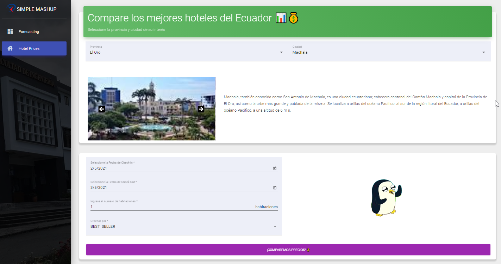

<h1 align="center">SIMPLE-MASHUP</h1>
<p align="center"><i>✨ A simple mashup-service application to compare the price of hotels in Ecuador</i></p>
<div align="center">
  <a href="https://github.com/TheWorstOne/simple-mashup/stargazers"></a>
<a href="https://github.com/TheWorstOne/simple-mashup/network/members"></a>
<a href="https://github.com/TheWorstOne/simple-mashup/pulls"></a>
<a href="https://github.com/TheWorstOne/simple-mashup/issues"></a>
<a href="https://github.com/TheWorstOne/simple-mashup/graphs/contributors"></a>
<a href="https://github.com/TheWorstOne/simple-mashup/blob/master/LICENSE"></a>
</div>
<br>
<p align="center"><i>Interested in the project? Please visit my <a target="_blank" href="https://mangelladev.web.app/">website</a></i></p>
<br>

<!-- ABOUT THE PROJECT -->
This repository was created as an exercise to test our knowledge of orchestrating different web services, called Mashup. The application focuses on gathering the information of the provinces and cities of Ecuador and then obtaining the data of hotels within a particular city in order to compare prices. Check out the [Demo](https://simple-mashup.web.app/#/hotel)!

<p align="center">
  <a href="">
    
  </a>
</p>
<br>

If you like this Repo, Please click the :star:

<!-- TABLE OF CONTENTS -->
## **Contents**
  - [Getting Started](#getting-started)
  - [License](#license)
  - [Contact](#contact)
  - [Acknowledgements](#acknowledgements)

  <!-- GETTING STARTED -->
## **Getting Started**

To get a local copy up and running follow these simple example steps.

### **Installation**

1. Clone the repo
   ```sh
   git clone https://github.com/TheWorstOne/simple-mashup.git
   ```
2. Install NPM packages
   ```sh
   npm install
   ```


<!-- LICENSE -->
## **License**

Distributed under the MIT License. See `LICENSE` for more information.


<!-- CONTACT -->
## **Contact**

Miguel Ángel Macías - 👨‍💻[Linkedin](https://www.linkedin.com/in/mangelladev/)

My Personal Website: ✨[mangelladev.com](https://mangelladev.web.app/)


<!-- ACKNOWLEDGEMENTS -->
## **Acknowledgements**
* [Jonnathan Campoberde](https://github.com/JonnHenry) a good friend of mine and the person in charge of developing the backend


